# SFMIS Frontend — Complete Technical Documentation

> **Sports Facility Management & Access Control System (SFMIS)** — Frontend (React SPA)
> University of Sri Jayewardenepura · Physical Education Unit
>
> This document reverse-engineers the entire `frontend/` codebase. It is written so you can answer any technical interview or client question about the project.
>
> **Notation:** Statements about the **backend** (Laravel) are inferred from the service-layer comments, the project `CLAUDE.md`, and observed request/response shapes. Such inferences are explicitly marked **[Assumption]**. Everything about the **frontend** is verified against the actual source, with `file:line`-style references.

---

## Table of Contents

1. [Project Overview](#1-project-overview)
2. [Folder Structure](#2-folder-structure)
3. [Technology Stack](#3-technology-stack)
4. [Application Architecture](#4-application-architecture)
5. [Data Flow](#5-data-flow)
6. [State Management](#6-state-management)
7. [API Documentation](#7-api-documentation)
8. [Authentication Flow](#8-authentication-flow)
9. [Feature Flow](#9-feature-flow)
10. [Component Relationships](#10-component-relationships)
11. [Custom Hooks](#11-custom-hooks)
12. [Business Logic](#12-business-logic)
13. [Form Flow](#13-form-flow)
14. [Routing Flow](#14-routing-flow)
15. [Error Handling](#15-error-handling)
16. [Performance](#16-performance)
17. [Security](#17-security)
18. [End-to-End Flow](#18-end-to-end-flow)
19. [Sequence Diagrams](#19-sequence-diagrams)
20. [Possible Interview Questions (100+)](#20-possible-interview-questions)
21. [Things Missing / Bugs / Refactors](#21-things-missing)
22. [Overall Summary](#22-overall-summary)

---

## 1. Project Overview

### What is this application?

A **single-page web client** for a university **Sports Facility Management & Access Control System**. It lets students, coaches/clubs, and independent members register, pay, and (eventually) book sports facilities and gain QR-based gate access — and gives back-office operators (admins) a separate RBAC console to manage system users and roles.

It is the **React frontend half** of a two-app system; the backend is a **Laravel 12 REST API + MySQL** (the system of record). The two are deployed independently and talk over HTTP/JSON (and `multipart/form-data` for uploads).

### What problem does it solve?

Universities traditionally manage sports-facility memberships, club registrations, fee payments, and gate access on paper / across disconnected systems. SFMIS centralizes the full lifecycle:

- **Onboarding** — email-verified self-registration for members and clubs.
- **Approval workflow** — club coaches approve/reject student join-requests; payment activates membership.
- **Payments** — a (currently simulated) registration-fee payment step.
- **Operations** — facility availability viewing, attendance tracking, payment history.
- **Administration** — role-based back-office for managing operator accounts and permission sets.

### Main features

| Area | Feature |
|---|---|
| Public site | Marketing home page with tabs (Home/About/Facilities/Membership/How It Works) and an inline OTP login card. |
| Auth (members) | Passwordless **email-OTP** login & registration gating. |
| Registration | Two flows: **Student/Member** (single multi-step form) and **Club/Coach** (multi-coach wizard + live fee preview). |
| Payment | Payment-pending status page → method selection → simulated payment → activation. |
| Coach dashboard | Club overview, **approve/reject** student verification requests, members, facility availability, attendance, payments, analysis, coordinators, settings. |
| Member dashboards | Shared dashboard for **Club Student** & **Independent**: book facility (availability grid), attendance, payments, profile, (club tab for club students). |
| Admin (back-office) | **Token + RBAC** login, dashboard, **System Users** CRUD, **Roles & Permissions** management with a ~70-permission matrix. |

### User types (actors)

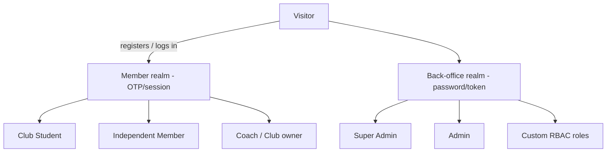

There are **two completely separate identity systems**:

1. **Member realm** — students, independent members, coaches. Identity = email OTP held in a **Laravel session cookie**. No password.
2. **Back-office realm** — system operators (Super Admin / Admin / custom roles). Identity = **email + password** → **Sanctum bearer token** in `sessionStorage`.

---

## 2. Folder Structure

```
frontend/
├── public/                      # CRA static host (index.html, favicon, etc.)
├── src/
│   ├── index.js                 # React entry — mounts <App/> in StrictMode
│   ├── App.js                   # Router + <Toaster/> + <AuthProvider/>; all routes inline
│   ├── index.css                # Tailwind directives + global styles
│   │
│   ├── assets/                  # Bundled images (logo, hero photos) — imported, work offline
│   │
│   ├── components/
│   │   ├── auth/                # Auth-flow building blocks
│   │   │   ├── AuthShell.jsx        # Split-screen layout w/ rotating image carousel
│   │   │   ├── EmailStep.jsx        # Email entry + "Send OTP" (with beforeSend hook)
│   │   │   ├── OtpStep.jsx          # 6-box OTP entry + countdown + verify
│   │   │   └── ProtectedRoute.jsx   # Back-office route guard (auth + permission/superadmin)
│   │   └── common/
│   │       ├── DashboardUI.jsx      # Shared design system: tokens, Icon, Pill, Avatar, StatCard, Spinner, EmptyState, button/input classes
│   │       ├── Button.jsx           # (empty placeholder)
│   │       ├── Input.jsx            # (empty placeholder)
│   │       └── Logo.jsx             # (empty placeholder)
│   │
│   ├── context/
│   │   └── AuthContext.jsx      # Back-office auth provider + useAuth (RBAC state)
│   │
│   ├── hooks/
│   │   └── useAuth.js           # Re-exports useAuth from AuthContext (conventional import path)
│   │
│   ├── routes/
│   │   └── AppRouter.jsx        # EMPTY placeholder (routing actually lives in App.js)
│   │
│   ├── services/               # API layer — the ONLY place axios is called
│   │   ├── api.js                  # Axios instance, token storage, interceptors, storageUrl()
│   │   ├── authService.js          # send-otp / verify-otp / member registration
│   │   ├── memberService.js        # member CRUD, payments, isEmailRegistered, simulate payment
│   │   ├── coachService.js         # club verification, members, facilities, attendance, payments
│   │   ├── systemAuthService.js    # back-office login/me/logout (token)
│   │   ├── systemUserService.js    # system-user CRUD (RBAC-gated)
│   │   └── systemRoleService.js    # roles & permissions CRUD
│   │
│   └── pages/                  # Screen-level components grouped by actor
│       ├── HomePage.jsx            # Public marketing site
│       ├── auth/
│       │   ├── LoginPage.jsx           # OTP login + post-verify routing
│       │   ├── SelectRegistration.jsx  # "Student vs Club" chooser
│       │   ├── StudentRegistration.jsx # Member registration (email→otp→details→summary→submitted)
│       │   ├── ClubRegistration.jsx    # Club registration wizard (multi-coach)
│       │   ├── RegistrationStatus.jsx  # Payment-pending summary (read-only)
│       │   └── PaymentMethod.jsx       # Payment method picker → simulate payment
│       ├── coach/CoachDashboard.jsx
│       ├── member/MemberDashboard.jsx  # Shared dashboard (club + independent)
│       ├── student/StudentDashboard.jsx     # <MemberDashboard variant="club"/>
│       ├── independent/IndependentDashboard.jsx # <MemberDashboard variant="independent"/>
│       └── admin/
│           ├── AdminLogin.jsx
│           ├── AdminLayout.jsx          # Sidebar shell + <Outlet/>
│           ├── AdminDashboard.jsx       # Overview cards
│           ├── SystemUsers.jsx          # User CRUD
│           └── Roles.jsx                # Roles + permission matrix
```

### Why each important folder exists

- **`services/`** — A strict boundary: components never call `axios` directly except a few legacy spots in the registration pages (`StudentRegistration.jsx`, `ClubRegistration.jsx` import `api` directly). The pattern is "add an endpoint here, not in a component." Each service also **normalizes response shapes** (the backend wraps single records in nested arrays like `[[ … ]]`; services unwrap them).
- **`pages/{actor}/`** — Screens are grouped by **who uses them**, which mirrors the two identity realms and the role split.
- **`components/auth/`** — Reusable steps of the OTP flow, shared by the login page and (conceptually) the registration gates.
- **`components/common/DashboardUI.jsx`** — A single source of truth for the in-app visual language (colors, icons, pills, avatars). The admin pages consume it; the member/coach dashboards predate it and inline equivalent tokens.
- **`context/` + `hooks/`** — Hold the **back-office** auth state only. The member realm deliberately does **not** use context (it passes the member object via router state + `sessionStorage`).
- **`routes/AppRouter.jsx`** — An empty placeholder; routing is defined inline in `App.js`. **[Note]** This is a vestigial file.

---

## 3. Technology Stack

| Library | Version | Why it's used | How it fits |
|---|---|---|---|
| **React** | 19.2 | Core UI library. Function components + hooks only (no classes). | Renders all screens; `index.js` mounts `<App/>` with `React.StrictMode`. |
| **react-dom** | 19.2 | DOM renderer for React. | `ReactDOM.createRoot(...).render(...)`. |
| **react-router-dom** | 7.17 | Client-side routing + navigation. | `BrowserRouter`/`Routes`/`Route` in `App.js`; `useNavigate`, `useLocation`, `NavLink`, `Outlet`, `Navigate`. Router **state** is the primary cross-page data carrier (`navigate(path, { state })`). |
| **axios** | 1.17 | HTTP client. | One configured instance in `api.js` with `withCredentials: true` (session cookie) + a request interceptor (Bearer token) + a response interceptor (401 → admin logout). |
| **react-hot-toast** | 2.6 | Toast notifications. | `<Toaster/>` mounted once in `App.js`; `toast.success/error/...` used across flows. |
| **tailwindcss** | 3.4 | Utility-first CSS. | Nearly all styling is Tailwind classes; design tokens (brand colors) are applied via inline `style={{}}` where Tailwind's palette doesn't match the brand navy/gold. |
| **react-scripts (CRA)** | 5.0.1 | Build tooling / dev server / Jest setup. | `npm start`, `npm run build`, `npm test`. No CRA eject. |
| **@testing-library/** + **jest-dom** | — | Component testing. | Configured via `setupTests.js`; only the default `App.test.js` exists. |
| **web-vitals** | 2.1 | Performance metric reporting. | `reportWebVitals()` called in `index.js` (no sink wired up). |

### Notably **absent** (and why it matters for interviews)

- **No Redux / Zustand / MobX / Recoil** — global state is minimal; only the back-office uses a single React Context.
- **No React Query / SWR** — data fetching is hand-rolled `useEffect` + `useState` + service functions, with manual loading/error handling and no caching/dedup.
- **No TypeScript** — plain JS/JSX.
- **No form library** (Formik/RHF) — validation is hand-written per form.
- **No code splitting / lazy loading** — all routes are statically imported in `App.js`.

### How they work together

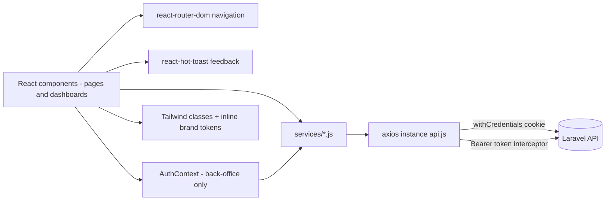

---

## 4. Application Architecture

### High-level layering

```
┌──────────────────────────────────────────────────────────────────┐
│  PRESENTATION (pages/* + components/*)                             │
│  - Screen components own their UI state (useState)                 │
│  - Render via Tailwind + DashboardUI primitives                    │
└───────────────┬──────────────────────────────────────────────────┘
                │ calls service functions; navigates with router state
┌───────────────▼──────────────────────────────────────────────────┐
│  CROSS-CUTTING                                                     │
│  - AuthContext (back-office RBAC state, useAuth)                   │
│  - ProtectedRoute (route gate)                                     │
│  - react-router (routing) + react-hot-toast (feedback)             │
└───────────────┬──────────────────────────────────────────────────┘
                │
┌───────────────▼──────────────────────────────────────────────────┐
│  SERVICE LAYER (services/*.js)                                     │
│  - One function per endpoint                                       │
│  - Response unwrapping ([[ ]] → object), param shaping             │
└───────────────┬──────────────────────────────────────────────────┘
                │
┌───────────────▼──────────────────────────────────────────────────┐
│  TRANSPORT (services/api.js)                                       │
│  - Axios instance: baseURL, withCredentials                        │
│  - Request interceptor: attach Bearer token                        │
│  - Response interceptor: 401 on /api/system/* → clear + redirect   │
│  - storageUrl(): rewrite file URLs to API_BASE                     │
└───────────────┬──────────────────────────────────────────────────┘
                │ HTTP (JSON / multipart) — cookie + bearer
┌───────────────▼──────────────────────────────────────────────────┐
│  BACKEND (Laravel) — system of record                              │
└──────────────────────────────────────────────────────────────────┘
```

### Architectural styles in play

- **Component architecture** — Function components with hooks. Pages are "smart" (own data + state); `components/common/DashboardUI.jsx` provides "dumb" presentational primitives (`Pill`, `Avatar`, `StatCard`, `EmptyState`, `Spinner`, `Icon`).
- **Actor/feature-based folders** — `pages/{auth,admin,coach,member,student,independent}`.
- **Service-layer / API gateway** — `services/*` wraps every endpoint; `api.js` is the single transport.
- **State management** — Predominantly **local component state**; one **Context** for back-office auth; **router state + sessionStorage** for member identity hand-off (a deliberate "no global store" choice).
- **Routing architecture** — Flat public routes + one **nested protected route tree** for `/admin` (layout route with `<Outlet/>` and per-child guards).
- **Composition over inheritance** — `StudentDashboard`/`IndependentDashboard` are thin wrappers that render the same `MemberDashboard` with a `variant` prop.

### The "two realms" architecture (the single most important concept)

| | Member realm | Back-office realm |
|---|---|---|
| Pages | Home, login, registration, dashboards | `/admin/*` |
| Identity | Email OTP → **session cookie** | Email+password → **Sanctum bearer token** |
| Token storage | none (cookie managed by browser) | `sessionStorage["sfmis_admin_token"]` |
| State holder | router state + `sessionStorage["sfmis_member"/"sfmis_coach"]` | `AuthContext` (`useAuth`) |
| Route guard | none (client-side); backend 403s ungated writes | `ProtectedRoute` (auth + permission/super-admin) |
| Transport | `withCredentials` cookie | `Authorization: Bearer` header (interceptor) |

Both realms share **the same axios instance** — harmless because session routes ignore the bearer header and `/api/system/*` routes ignore the cookie (`api.js:18-23`).

---

## 5. Data Flow

### General shape

```
User action (click / type)
        ↓
UI component event handler (useState updates)
        ↓
Client-side validation (per-form validate* functions)
        ↓
Service function call (services/*.js)
        ↓
axios instance (api.js) — cookie + bearer attached
        ↓
Laravel API → MySQL
        ↓
Response (JSON; single records often wrapped [[ ]])
        ↓
Service unwraps/normalizes → returns plain JS
        ↓
Component setState (data / loading / error)
        ↓
React re-render + toast feedback + (optional) navigate(state)
```

### Why there is no "store update" step

Because there is **no global store** for domain data. Each screen fetches what it needs on mount/tab-change and holds it in local `useState`. Cross-screen data is carried by `navigate(path, { state })` and mirrored into `sessionStorage` so a refresh survives (dashboards) — see [§6](#6-state-management).

### Feature data-flow diagrams

**(a) OTP login → dashboard routing**

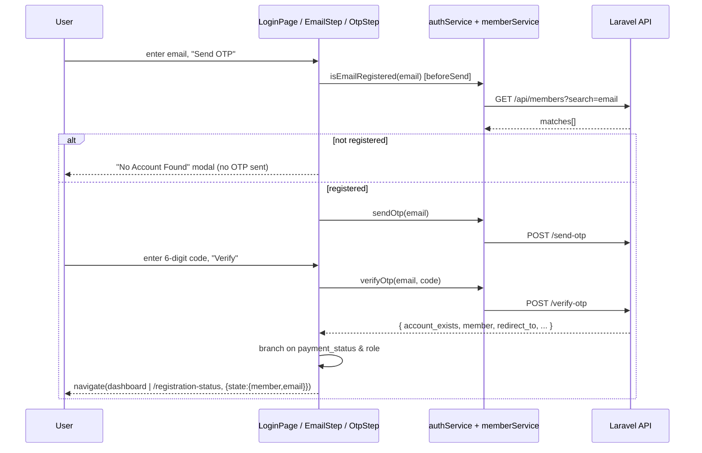

**(b) Member registration (multipart)**

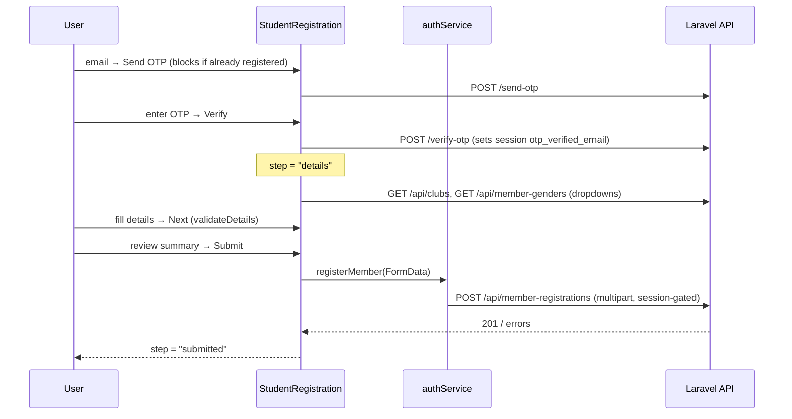

**(c) Coach approves a club-student request**

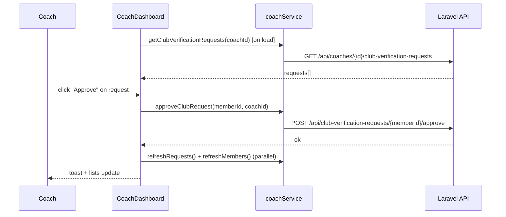

**(d) Back-office: edit role permissions**

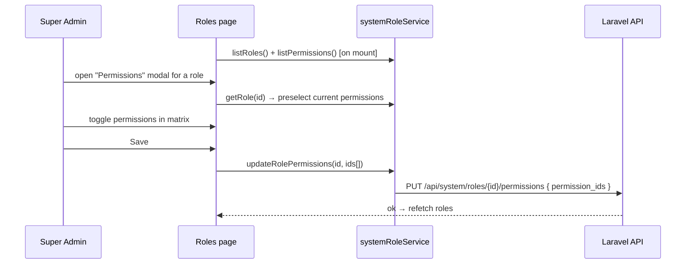

---

## 6. State Management

There are **five distinct state mechanisms**, each chosen for a reason.

### 1. Local component state (`useState`) — the default
Every page owns its data. Examples:
- `CoachDashboard.jsx` holds `club`, `requests`, `members`, `facilities`, `payments`, plus per-tab state (`availability`, `attendances`, `coordinators`) and UI flags (`sidebarOpen`, `notifOpen`, `actingId`).
- Forms hold their fields + `fieldErrors` + `submitting` + `submitError`.

### 2. React Context (`AuthContext`) — back-office only
`context/AuthContext.jsx` holds the **only** global state: the authenticated **system user**, their `permissions[]`, `role`, `loading`, and the `login`/`logout`/`can` helpers. Exposed via `useAuth()` (re-exported from `hooks/useAuth.js`).

```
value = { user, role, permissions, loading, isAuthenticated, isSuperAdmin, login, logout, can }
```

Why Context here but not for members? The admin area has **many** screens that all need the same identity + permission checks (sidebar, route guards, dashboard cards), and identity must survive refresh by re-hydrating from a stored token. The member realm has a simpler need (one member object handed to one dashboard), solved with router state.

### 3. Router state (`navigate(path, { state })`) — cross-page hand-off
The member object travels between pages via router state:
- `LoginPage` → `navigate("/coach-dashboard", { state: { member } })`
- `RegistrationStatus` → `navigate("/payment-method", { state: { member, email } })`
- Pages read it with `useLocation().state` and **redirect to `/login` if absent** (e.g. `RegistrationStatus.jsx:162-164`, `PaymentMethod.jsx:57-59`).

### 4. `sessionStorage` — refresh persistence for member dashboards
Dashboards mirror the member into `sessionStorage` so a page refresh keeps the user "logged in":
- `MemberDashboard` → key `sfmis_member`
- `CoachDashboard` → key `sfmis_coach`
- Admin token → key `sfmis_admin_token` (in `api.js`)

`sessionStorage` (not `localStorage`) is deliberate: it survives in-tab refresh but **not** a new browser session — see `api.js:24-38` (admin token rationale + a one-time `localStorage` cleanup migration).

### 5. Derived state (`useMemo`) — computed views
E.g. `CoachDashboard` derives `clubMemberIds` and `clubAttendances` (filtering the global attendance feed to club members), and `stats`. Photo preview URLs are memoized to avoid blob leaks (`StudentRegistration.jsx:84-93`).

### Loading / error state pattern

Each async screen uses the same hand-rolled trio:
```js
const [loading, setLoading]   = useState(true);
const [data, setData]         = useState(initial);
const [error, setError]       = useState("");  // or per-field fieldErrors
```
- **Loading** → spinner / skeleton text.
- **Error** → inline message + `toast.error(...)`.
- **No cache layer** — revisiting a tab refetches (there's an explicit "Refresh" button on dashboards).

### State summary table

| Mechanism | Scope | Used by | Survives refresh? |
|---|---|---|---|
| `useState` | one component | everywhere | no |
| `useMemo` derived | one component | dashboards, selectors | n/a |
| `AuthContext` | app-wide | back-office only | via token re-hydration |
| Router `state` | navigation hand-off | member flows | no (lost on refresh → redirect) |
| `sessionStorage` | tab | member/coach dashboards, admin token | yes (per tab) |

---

## 7. API Documentation

All endpoints are reached through `services/*.js`. `API_BASE = process.env.REACT_APP_API_URL || "http://localhost:8000"` (`api.js:4`). Backend route/response details are **[Assumptions]** based on service comments and `CLAUDE.md`.

### Conventions
- **Session-gated writes** (member/club registration) require an OTP-verified session cookie; backend returns **403** if missing.
- **CSRF**: backend routes ride the `web` middleware; write endpoints must be CSRF-exempted server-side (the SPA sends no CSRF token). **[Assumption]**
- **Single-record wrap**: `show`/`update`-style endpoints return `[[ {…} ]]`; services unwrap.
- **Method spoofing**: member update sends `POST` with `_method=PUT` (PHP can't parse multipart on PUT) — `memberService.js:21-26`.

### 7.1 Auth & OTP — `authService.js`

| Endpoint | Method | Request | Response (shape) | Called from | On success | On failure |
|---|---|---|---|---|---|---|
| `/send-otp` | POST | `{ email }` | `{ message }` | `EmailStep`, `HomePage` LoginCard, `StudentRegistration`, `ClubRegistration` | advance to OTP step; toast | inline error / toast |
| `/verify-otp` | POST | `{ email, otp }` | `{ account_exists, member?, redirect_to?, role?/member_type? }` | `OtpStep`, registration pages | route by role/payment, or advance step | inline error + toast |
| `/api/member-registrations` | POST (multipart) | member fields + `photo` | `201` | `StudentRegistration.handleSubmit` | `step="submitted"` | first field error / message |

### 7.2 Members — `memberService.js`

| Endpoint | Method | Request | Response | Called from | On success | On failure |
|---|---|---|---|---|---|---|
| `/api/members/{id}` | GET | — | member object (unwrapped from `[obj]`) | `RegistrationStatus`, `CoachDashboard`, `MemberDashboard` | enrich member (photo, full fields) | silent `.catch(()=>{})` |
| `/api/members/{id}` | POST + `_method=PUT` (multipart) | partial personal fields + optional `photo` | updated member | (wired for inline edit on status page) | updated object | — |
| `/api/payments?payer_id=` | GET | query | payments[] | `PaymentMethod`, `MemberDashboard` | show amount / list | `[]` |
| `/api/payment/simulate-success/{id}` | POST | — | updated summary | `PaymentMethod.handleContinue` | navigate back to status | inline error |
| `/api/members?search=` | GET | query | members[] | `isEmailRegistered` | exact-email match → boolean | treated as "registered" (fail-open) |

`isEmailRegistered` reuses the search endpoint (no dedicated "exists" endpoint) and confirms an **exact case-insensitive** email match to avoid LIKE false positives (`memberService.js:44-51`).

### 7.3 Coach / Club / Facilities — `coachService.js`

| Endpoint | Method | Purpose | Called from |
|---|---|---|---|
| `/api/coaches/{coachId}/club-verification-requests` | GET | pending student join requests | CoachDashboard |
| `/api/club-verification-requests/{memberId}/approve` | POST `{ coach_id }` | approve student | CoachDashboard |
| `/api/club-verification-requests/{memberId}/reject` | POST `{ coach_id }` | reject (→ Independent) | CoachDashboard |
| `/api/members?club_id=&[member_type_id=]` | GET | club members / coordinators | CoachDashboard, RegistrationStatus |
| `/api/member-types` | GET | resolve "Coach" type id | CoachDashboard |
| `/api/facilities` | GET | facility list (+ slot_count, booking_fee) | Coach/Member dashboards |
| `/api/facilities/{id}/availability?date=` | GET | availability grid (unwrap `[[ ]]`) | Coach/Member dashboards |
| `/api/clubs/{id}` | GET | club detail (unwrap `[[ ]]`) | RegistrationStatus, dashboards |
| `/api/payments?club_id=` | GET | club payments | CoachDashboard |
| `/api/attendances?[date|member_id]=` | GET | attendance scans | Coach/Member dashboards |

### 7.4 Direct calls in components (not yet in a service)

| Endpoint | Method | Where |
|---|---|---|
| `/api/clubs` | GET | `StudentRegistration` (filters to `club_status === "Active"`) |
| `/api/member-genders` | GET | `StudentRegistration`, `ClubRegistration` |
| `/api/club-registration-fee-preview` | POST `{ coach_count }` | `ClubRegistration` (live fee preview) |
| `/api/club-registrations` | POST (multipart) | `ClubRegistration.handleSubmit` |

### 7.5 Back-office auth — `systemAuthService.js`

| Endpoint | Method | Request | Response | On success | On failure |
|---|---|---|---|---|---|
| `/api/system/login` | POST | `{ email, password }` | `{ token, user }` | store token, set user | 401 → "Invalid email or password." |
| `/api/system/me` | GET | (bearer) | `{ user }` | re-hydrate user | 401 → token cleared, redirect |
| `/api/system/logout` | POST | (bearer) | — | clear token locally (even if network fails) | clears locally regardless |

`user` = `{ id, name, email, role:{id,name}, permissions:[], is_active, last_login_at }`.

### 7.6 System users — `systemUserService.js` (RBAC-gated)

| Endpoint | Method | Request | UI permission |
|---|---|---|---|
| `/api/system/users` | GET | `{ search?, role_id?, is_active? }` | `view_system_users` |
| `/api/system/users/{id}` | GET | — | — |
| `/api/system/users` | POST | `{ name, email, password, role_id, is_active? }` | `create_system_users` |
| `/api/system/users/{id}` | PUT | `{ name?, email?, role_id?, is_active? }` | `edit_system_users` |
| `/api/system/users/{id}/status` | PATCH | `{ is_active }` | `deactivate_system_users` |
| `/api/system/users/{id}/reset-password` | POST | `{ password }` | `reset_system_user_password` |

`unwrap()` peels nested single-element arrays so callers always get a plain object (`systemUserService.js:10-14`).

### 7.7 Roles & permissions — `systemRoleService.js`

| Endpoint | Method | Request | Notes |
|---|---|---|---|
| `/api/system/roles` | GET | — | `{id,name,description,permissions_count,system_users_count}` |
| `/api/system/permissions` | GET | — | `{id,name,description}` (~70 of them) |
| `/api/system/roles/{id}` | GET | — | includes `permissions[]` |
| `/api/system/roles` | POST | `{ name, description }` | create (no perms yet) |
| `/api/system/roles/{id}` | PUT | `{ name?, description? }` | rename |
| `/api/system/roles/{id}` | DELETE | — | blocked if users assigned |
| `/api/system/roles/{id}/permissions` | PUT | `{ permission_ids:number[] }` | **replaces** the set (sync) |
| `createRoleWithPermissions()` | composite | create → then sync perms | two calls (`systemRoleService.js:52-58`) |

---

## 8. Authentication Flow

There are **two** complete flows.

### 8.1 Member realm — passwordless email OTP (session cookie)

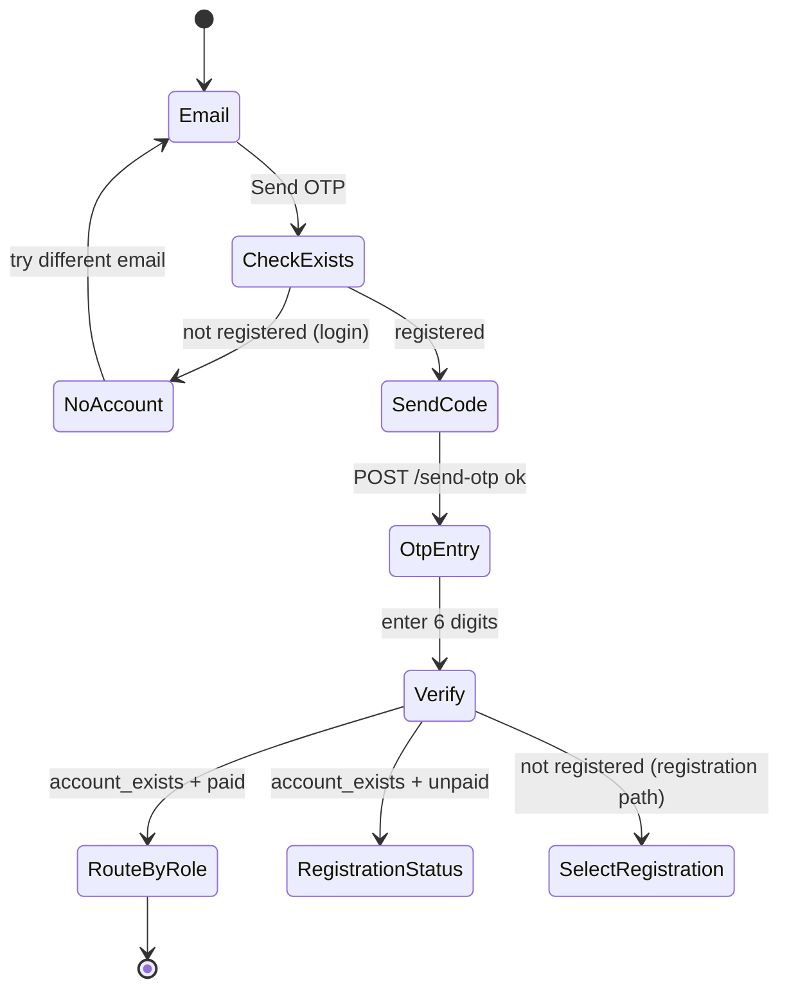

**Step-by-step (login):**
1. User enters email in `EmailStep` (or the home-page LoginCard).
2. `beforeSend(email)` → `isEmailRegistered()` (`LoginPage.jsx:55-70`). If **not** registered → "No Account Found" modal, **no OTP sent**. If lookup fails → fail-open (proceed).
3. `sendOtp(email)` → backend emails a 6-digit code and stores `otp` + `otp_verified_email=null` in the **Laravel session** (3-min expiry). **[Assumption]**
4. `OtpStep` collects 6 digits (auto-advance, paste support, 165 s countdown) → `verifyOtp(email, code)`.
5. Backend sets `otp_verified_email` in the session and returns `{ account_exists, member, redirect_to }`.
6. `LoginPage.handleVerify` branches (`LoginPage.jsx:72-138`):
   - **Not registered** → "No Account Found" modal.
   - **Registered + unpaid** (`payment_status` not "paid") → `/registration-status`.
   - **Registered + paid** → role-routed dashboard (`coach` / `club` student / `independent`), else a placeholder message.

**Token storage (member):** none in JS — the **session cookie** is the credential, carried automatically by `withCredentials: true`. The member *object* is stored in router state + `sessionStorage` for UI continuity (not auth).

**Logout (member):** dashboards just `sessionStorage.removeItem(...)` + navigate to `/login` (`CoachDashboard.jsx:398-401`, `MemberDashboard.jsx:219-222`). The server session isn't explicitly destroyed client-side.

**Refresh token:** none — OTP is single-use per action; there's no long-lived member session token concept in the frontend.

### 8.2 Back-office realm — password + Sanctum bearer token

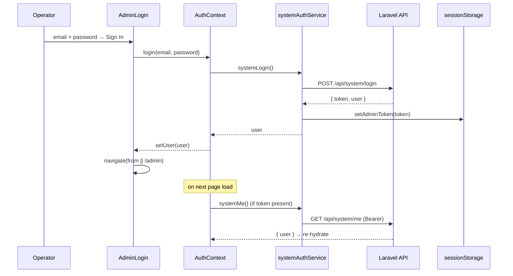

**Token storage (admin):** `sessionStorage["sfmis_admin_token"]` (`api.js:30`). A request interceptor attaches `Authorization: Bearer <token>` to **every** request (`api.js:60-67`).

**Re-hydration:** on app mount, `AuthProvider` checks for a token; if present, calls `systemMe()`. A dead token (401) is cleared and the user is dropped (`AuthContext.jsx:26-42`).

**Protected routes:** `ProtectedRoute` (`components/auth/ProtectedRoute.jsx`) — while `loading`, shows a spinner (avoids login flash); if not authenticated → `<Navigate to="/admin/login" state={{from}}>`; if missing the required `permission` or `requireSuperAdmin` → "Access Denied" screen.

**401 handling:** the response interceptor (`api.js:72-88`) detects a 401 on `/api/system/*` (except the login call), clears the token, and `window.location.assign("/admin/login")` unless already there. Member/public routes are untouched.

**Logout (admin):** `systemLogout()` → `POST /api/system/logout` (revokes server-side), then clears local token **even if the network call fails** (`systemAuthService.js:27-33`).

**Why `sessionStorage`, not `localStorage`?** A persisted token would silently re-authenticate on the next browser visit, bypassing the login page. Admin access must require an explicit login each session. A one-time migration removes any legacy `localStorage` token (`api.js:32-38`).

---

## 9. Feature Flow

For each major feature: **User clicks → Component → (Hook) → API → Backend → State → UI update.**

### 9.1 Marketing site + inline login (`HomePage`)
```
Click tab → setActiveTab() → renderTab() switch → scroll top
Type email in LoginCard → submit → isEmailRegistered → (modal | sendOtp) → navigate("/login",{state})
```
No persistent state; tabs are in-page (no route change). `scrolled` tracked via a window scroll listener (`HomePage.jsx:623-627`).

### 9.2 Member registration (`StudentRegistration`)
```
email → handleSendOtp (blocks if registered) → POST /send-otp
otp → handleVerifyOtp → POST /verify-otp (sets session)
details → load /api/clubs + /api/member-genders → fill → handleNext (validateDetails)
summary → handleSubmit → POST /api/member-registrations (FormData)
submitted → success screen
```
State machine: `step ∈ {email, otp, details, summary, submitted}`.

### 9.3 Club registration (`ClubRegistration`)
```
phase: email → otp → wizard (numeric step 1→2→3)
step 1 Club Details (validateClub)
step 2 Coaches[] (validateCoaches; only primary photo required) + live fee preview (POST /api/club-registration-fee-preview)
step 3 Summary → handleSubmit → POST /api/club-registrations (coaches JSON + coach_photos[i])
submitted → success screen
```

### 9.4 Login routing (`LoginPage`) — see §8.1.

### 9.5 Payment (`RegistrationStatus` → `PaymentMethod`)
```
RegistrationStatus: getMember(id) enrich → workflow tracker (steps) → "Complete Payment"
PaymentMethod: getMemberPayments(id) → pick method → POST /api/payment/simulate-success/{id} → back to status
```

### 9.6 Coach dashboard (`CoachDashboard`)
```
load: Promise.allSettled([getClub, getClubVerificationRequests, getClubMembers, getFacilities, getClubPayments])
tab change lazily loads: availability | attendance | coordinators
Approve/Reject → coachService → refreshRequests + refreshMembers
```

### 9.7 Member dashboards (`MemberDashboard`)
```
load: Promise.allSettled([getFacilities, getAttendances{member_id}, getMemberPayments, getClub?])
book tab → getFacilityAvailability(facility, date) → availability grid
```

### 9.8 Admin: System Users (`SystemUsers`)
```
mount: listRoles(); debounced listSystemUsers(filters)
Add/Edit → modal UserForm → create/updateSystemUser → refetch
Toggle status → setSystemUserStatus (self disabled)
Reset → resetSystemUserPassword
```

### 9.9 Admin: Roles (`Roles`)
```
mount: listRoles() + listPermissions()
Create → createRoleWithPermissions (create then sync perms)
Edit → updateRole; Permissions → getRole(preselect) → updateRolePermissions
Delete → deleteRole (blocked if users assigned or protected role)
```

---

## 10. Component Relationships

### Top-level tree

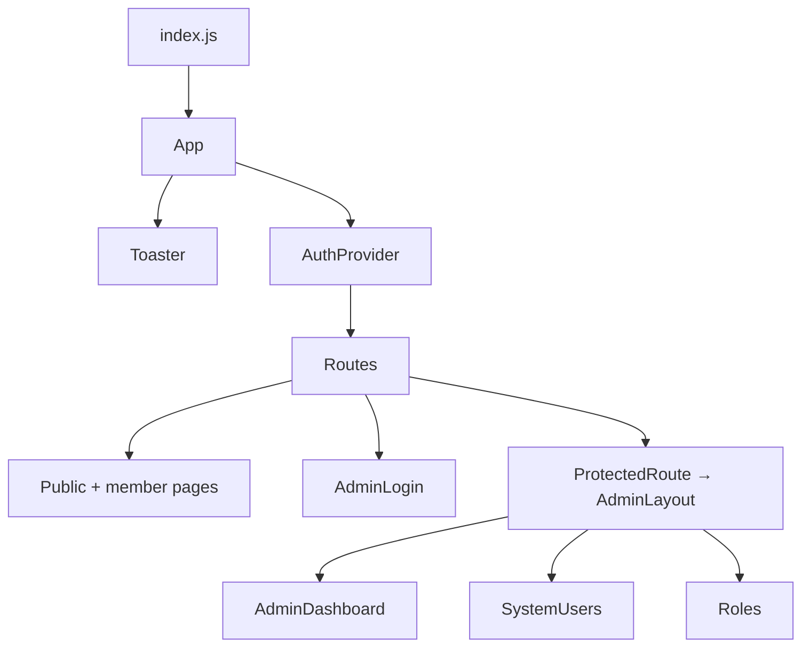

### Member/auth page composition

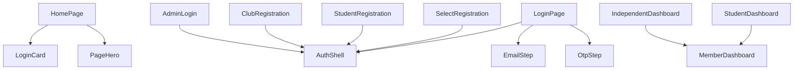

### Shared / reusable components

| Component | Reused by | Notes |
|---|---|---|
| `AuthShell` | LoginPage, SelectRegistration, StudentRegistration, ClubRegistration, AdminLogin | Split-screen layout + rotating hero carousel. |
| `EmailStep`, `OtpStep` | LoginPage (registration pages re-implement inline equivalents) | OTP building blocks. |
| `DashboardUI.*` (`Icon`, `Pill`, `Avatar`, `StatCard`, `EmptyState`, `Spinner`, tokens, button/input classes) | Admin pages (AdminLayout/Dashboard/SystemUsers/Roles) | The shared design system. |
| `ProtectedRoute` | App.js `/admin` subtree | Route guard. |
| `MemberDashboard` | StudentDashboard, IndependentDashboard | Behavior toggled by `variant`. |

### Parent ⇄ child contracts (props)
- `EmailStep({ onSend, beforeSend, initialEmail })` — `beforeSend` returning `false` aborts the send.
- `OtpStep({ email, onVerify, onResend })` — passes the raw verify response up.
- `ProtectedRoute({ permission?, requireSuperAdmin?, children })`.
- `MemberDashboard({ variant: "club" | "independent" })`.
- Modal sub-forms in `SystemUsers`/`Roles` take `{ onCancel, onSaved/onDone }` callbacks.

**Note:** `CoachDashboard`, `MemberDashboard`, and `HomePage` each define their **own** local `Icon`/`Pill`/`Avatar`/`EmptyState` rather than importing from `DashboardUI` — duplication that predates the shared module (see [§21](#21-things-missing)).

---

## 11. Custom Hooks

The project defines exactly **one** custom hook.

### `useAuth()` — `hooks/useAuth.js` (re-export) / `context/AuthContext.jsx` (impl)

- **Why it exists:** central access to back-office identity + RBAC so every admin screen and the route guard can read the user, role, permissions, and call `login`/`logout`/`can` without prop-drilling.
- **Inputs:** none (reads the nearest `<AuthProvider>` via `useContext`). Throws if used outside a provider (`AuthContext.jsx:89-93`).
- **Outputs:**
  ```js
  { user, role, permissions, loading, isAuthenticated, isSuperAdmin, login, logout, can }
  ```
  - `can(permission)` → `true` if no user→false; **Super Admin always true** (mirrors backend bypass); empty permission → true; else `permissions.includes(permission)`.
- **Side effects (in the provider, not the hook call):**
  - On mount: if a token exists, call `systemMe()` to re-hydrate `user`; clear token on failure (`useEffect`, `AuthContext.jsx:26-42`).
  - `login()` calls `systemLogin()` (stores token) then `setUser`.
  - `logout()` calls `systemLogout()` then clears `user`.

> Everything else commonly mistaken for a "hook" here is just React's built-in `useState/useEffect/useMemo/useCallback/useRef` used inline. There is **no** `useFetch`, `useForm`, etc.

---

## 12. Business Logic

The important domain rules enforced (or mirrored) on the client:

### Identity & registration
- **Login requires an existing account.** Before sending an OTP, the email is checked; unregistered emails are blocked with a "No Account Found" modal (`LoginPage.jsx:55-70`, `HomePage.jsx:163-176`).
- **Registration blocks duplicates.** Before OTP and again after verify (`account_exists`), an already-registered email is sent to login (`StudentRegistration.jsx:177-189, 246-249`; `ClubRegistration.jsx:140-152, 202-205`).
- **Fail-open on lookup error:** if `isEmailRegistered` throws, the flow proceeds (the backend's unique constraint / `account_exists` is the real guard).

### Post-login routing (`LoginPage.handleVerify`)
```
if !account_exists                → "register first"
else if payment not "paid"        → /registration-status
else if coach (redirect_to/role)  → /coach-dashboard
else if club student              → /student-dashboard
else if independent               → /independent-dashboard
else                              → placeholder message
```

### Club-student workflow (mirrored in `RegistrationStatus.steps`)
```
Email verified (done) → Form submitted (done)
→ [club students only] Club verification (done if club_id else active)
→ Payment (done if paid; "todo" if club student not yet verified; else active)
```
Payment is **gated**: `canPay = !(isClubStudent && !clubVerified)` (`RegistrationStatus.jsx:250`).

### Coach actions
- Approve → member becomes a club student; Reject → member moved to **Independent** (`CoachDashboard.jsx:372-396`).
- A coach not linked to a club (`!coach.club_id`) sees empty states everywhere.

### Fees (club registration)
- Base **LKR 5,000** includes the club + 2 coaches; each extra coach **+LKR 2,500** (`ClubRegistration.jsx:733-748`).
- Prefer the server `feePreview` total; fall back to the local estimate if the call fails or the key shape is unknown.

### Students may only join **Active** clubs
`StudentRegistration` filters `/api/clubs` to `club_status === "Active"` (`StudentRegistration.jsx:116-120`).

### Back-office RBAC (UI mirrors backend authority)
- **`can(permission)`** gates buttons and nav items; **Super Admin** bypasses all checks.
- **Roles & Permissions** module is **Super-Admin-only** (`AdminLayout.jsx:15`, route `requireSuperAdmin`).
- **Protected roles** "Super Admin" / "Admin" can't be renamed/deleted; Super Admin's permissions are locked (`Roles.jsx:27`, disabled buttons).
- **Self-protection:** an operator can't deactivate their own account (`SystemUsers.jsx:408-409`).
- Non-Super-Admins can't assign the "Super Admin" role (filtered from the dropdown — `SystemUsers.jsx:244-247`).
- **UI gating is UX only** — "the backend re-checks every permission on every request" (`AuthContext.jsx:14-15`).

### Validation rules (forms)
- **Initials:** must be single letters each followed by a dot, e.g. `T.N.` / `A.B.C.` — regex `/^([A-Za-z]\.\s?)+$/` (`StudentRegistration.jsx:285-286`).
- **Phone:** Sri Lankan `^0[1-9]\d{8}$` (10 digits starting 0) (`StudentRegistration.jsx:281`).
- **Photo:** member ≤ **2 MB**; coach ≤ **1 MB**; only **primary coach** photo required (`StudentRegistration.jsx:270`, `ClubRegistration.jsx:289, 341`).
- **DOB** capped at today (`max` attribute).

---

## 13. Form Flow

### Forms inventory
| Form | File | Validation | Submit |
|---|---|---|---|
| Email/OTP gates | EmailStep/OtpStep + registration pages | `email.includes("@")`, 6-digit OTP | send/verify OTP |
| Member registration | StudentRegistration | `validateDetails()` → `fieldErrors` map | `POST /api/member-registrations` |
| Club registration | ClubRegistration | `validateClub()` + `validateCoaches()` | `POST /api/club-registrations` |
| Payment method | PaymentMethod | must select a method | `POST /api/payment/simulate-success/{id}` |
| System user | SystemUsers.UserForm | HTML `required`/`minLength`, email type | create/update user |
| Reset password | SystemUsers.ResetPasswordForm | `minLength=8` | reset password |
| Role create/edit/permissions | Roles | name required; permission Set | create/update/sync |

### Validation strategy
- **Hand-rolled**, synchronous, returns an **error map** keyed by field name. A non-empty value drives both a red outline (`fieldClass(name)`) and an inline message (`fieldError(name)`).
- Errors **clear on edit**: `handleFormChange` wipes that field's error as soon as the user types (`StudentRegistration.jsx:260-265`).
- A summary line ("Please correct the highlighted fields below.") appears above the action button.
- The **summary tab is gated** — you can only reach review with valid data, and `handleSubmit` re-validates as a final guard (`StudentRegistration.jsx:331-334, 343-350`).

### Submission + error handling
```js
setSubmitting(true);
try {
  await registerMember(fd);
  setStep("submitted");        // success
} catch (err) {
  const data = err?.response?.data;
  const firstError = data?.errors ? Object.values(data.errors)[0]?.[0] : null;
  setSubmitError(firstError || data?.message || "…failed. Please try again.");
} finally {
  setSubmitting(false);
}
```
This **server-error extraction** (first Laravel validation error → top-level message → generic fallback) is repeated across forms and centralized in admin pages as `errMessage(err, fallback)` (`SystemUsers.jsx:58-65`, `Roles.jsx:30-37`).

### Multipart specifics
- `FormData` is built field-by-field; **`Content-Type` is never set manually** so the browser adds the multipart boundary (`authService.js:14-16`).
- Club coaches are sent as a **JSON string** under `coaches`, with photos keyed by index `coach_photos[i]` so a missing middle coach photo still pairs correctly (`ClubRegistration.jsx:405-411`).
- Member update spoofs PUT via `_method=PUT` (`memberService.js:22`).

### Focus-stability gotcha (good practice worth calling out)
In `ClubRegistration`, `Field`/`Input` helpers are defined at **module scope**, not inside the component — defining them inline would remount every `<input>` on each keystroke and lose focus (`ClubRegistration.jsx:28-51`).

---

## 14. Routing Flow

All routes are declared inline in `App.js` inside `<BrowserRouter><AuthProvider><Routes>`.

### Route table

| Path | Component | Type | Guard |
|---|---|---|---|
| `/` | HomePage | Public | — |
| `/login` | LoginPage | Public | — |
| `/select-registration` | SelectRegistration | Public | — |
| `/student-registration` | StudentRegistration | Public | — |
| `/club-registration` | ClubRegistration | Public | — |
| `/registration-status` | RegistrationStatus | Semi-private | redirects to `/login` if no router `state.member` |
| `/payment-method` | PaymentMethod | Semi-private | redirects to `/login` if no `state.member` |
| `/coach-dashboard` | CoachDashboard | Semi-private | needs `state.member` or `sessionStorage` |
| `/student-dashboard` | StudentDashboard → MemberDashboard | Semi-private | same |
| `/independent-dashboard` | IndependentDashboard → MemberDashboard | Semi-private | same |
| `/register` | StudentRegistration | Public (legacy alias) | — |
| `/clubregister` | ClubRegistration | Public (legacy alias) | — |
| `/admin/login` | AdminLogin | Public | redirects to `/admin` if already authed |
| `/admin` | AdminLayout (Outlet) | **Private** | `<ProtectedRoute>` (must be authenticated) |
| `/admin` (index) | AdminDashboard | Private | inherits parent guard |
| `/admin/users` | SystemUsers | Private | `<ProtectedRoute permission="view_system_users">` |
| `/admin/roles` | Roles | Private | `<ProtectedRoute requireSuperAdmin>` |

### Public vs private

- **Truly public:** `/`, `/login`, registration pages, `/admin/login`.
- **Semi-private (member realm):** dashboards & payment pages have **no real guard** — they rely on router state / `sessionStorage` and redirect to `/login` if missing. This is **UX, not security**; the backend enforces real access.
- **Private (back-office):** the `/admin/*` subtree is wrapped by `ProtectedRoute`, which enforces authentication and then per-page permission/super-admin checks.

### Nested routing (admin)
`/admin` is a **layout route**: `AdminLayout` renders the sidebar + header and an `<Outlet/>`; child routes render inside it. The sidebar items are filtered by `can(permission)`/`isSuperAdmin` so inaccessible links are hidden (`AdminLayout.jsx:24`), and the current page title is resolved by the **longest matching path** (`AdminLayout.jsx:28-31`).

### Navigation flow diagram

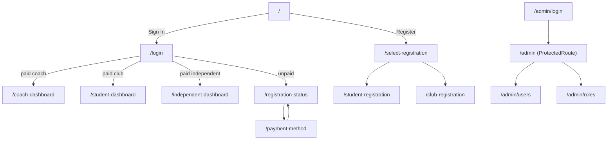

---

## 15. Error Handling

### API / server errors
- Per-call `try/catch` → extract a human message: first Laravel field error → top-level `message` → generic fallback (forms, `errMessage()` in admin).
- Surface via inline text **and/or** `toast.error(...)`.

### Network / unknown errors
- Dashboards use `Promise.allSettled([...])` so one failing call doesn't blank the whole page; each result is defaulted (e.g. `[]` / `null`) (`CoachDashboard.jsx:306-322`, `MemberDashboard.jsx:180-194`).
- Many enrichment fetches **swallow errors** silently (`.catch(() => {})`) because they're non-critical (e.g. fetching a photo).

### Validation errors
- Client: per-field maps with inline messages + red outlines + a summary line (see §13).
- Server: re-validated server-side; the first validation error is shown if the client missed it.

### Auth errors
- **Admin 401** is handled globally by the response interceptor: clear token + redirect to `/admin/login` (`api.js:72-88`).
- **Login 401** is special-cased to "Invalid email or password." and **not** auto-redirected (the login page shows its own message — `api.js:78`, `AdminLogin.jsx:42-47`).

### Retry logic
- **No automatic retries / backoff.** Recovery is manual: a "Refresh" button on dashboards and "Resend OTP" on OTP screens (with a 165 s countdown reset). The OTP timer is purely cosmetic/UX — expiry is enforced server-side.

### Cancellation / race safety
- Effects use an `on`/`active` boolean flag in cleanup to avoid `setState` after unmount and to ignore stale responses (e.g. `RegistrationStatus.jsx:167-177`, `CoachDashboard.jsx:329-345`). (Axios requests themselves are **not** aborted.)

---

## 16. Performance

### What's done well
- **`Promise.allSettled` parallel loads** on dashboards (no waterfalls; partial failure tolerated).
- **Lazy per-tab fetching** — availability/attendance/coordinators only load when their tab opens (`CoachDashboard.jsx:329-370`).
- **Debounced search** — system-user search/filter refetch is debounced 300 ms (`SystemUsers.jsx:262-265`).
- **`useMemo`/`useCallback`** for derived data and stable callbacks (`clubAttendances`, `stats`, refresh handlers).
- **Memoized blob URLs** with cleanup to prevent object-URL leaks for photo previews (`StudentRegistration.jsx:84-93`).
- **Module-scope sub-components** to keep input focus stable across renders (`ClubRegistration.jsx:28-51`).
- **Bundled local assets** — hero/logo images are imported (work offline, hashed by CRA).
- **`storageUrl()`** rewrites backend file URLs to `API_BASE` so images load regardless of the host the API advertises (`api.js:90-104`).

### What's missing / could improve
- **No route-level code splitting** (`React.lazy`/`Suspense`) — everything is statically imported in `App.js`; the marketing `HomePage` and the heavy dashboards all ship in one bundle.
- **No data caching / dedup** (no React Query) — switching tabs/pages refetches; multiple components independently call `getFacilities()`.
- **In-render `URL.createObjectURL`** for coach photo previews in `ClubRegistration` summary (`:808, :1002`) creates a new blob URL on every render without revoking — a minor leak (the memoized pattern used in `StudentRegistration` is the better approach).
- **Local `Icon`/`Pill`/`Avatar` duplication** across dashboards bloats the bundle slightly.
- **No virtualization** for potentially long tables (members, payments, attendance) — fine at expected scale, a risk at large scale.

---

## 17. Security

### Authentication
- **Member realm:** email OTP held in a **server session**; the browser carries a session cookie (`withCredentials: true`, required — `api.js:8-16`). No password, no JS-accessible token.
- **Back-office:** password login → **Sanctum bearer token** in `sessionStorage`, attached by interceptor.

### Authorization
- **Frontend RBAC is UX-only.** `can()`/`ProtectedRoute`/disabled buttons improve the experience but the **backend re-checks every permission** (explicitly noted, `AuthContext.jsx:14-15`). Hidden routes/buttons are not a security boundary.
- Server-side uniqueness (`unique:member_registration` on email/NIC, `unique:club_registration,reg_no`) is the real duplicate guard; the client `account_exists` check is convenience. **[Assumption per CLAUDE.md]**

### Token handling
- Admin token in **`sessionStorage`** (not `localStorage`) to avoid silent cross-session re-auth; legacy `localStorage` tokens are purged once (`api.js:24-55`).
- Token cleared on logout and on any `/api/system/*` 401.
- **XSS consideration:** `sessionStorage` tokens are readable by any script in the page; the app's main XSS defense is React's default escaping (no `dangerouslySetInnerHTML` anywhere) — but a token in web storage is inherently more exposed than an `HttpOnly` cookie. Worth flagging in an interview.

### XSS / injection
- React escapes all rendered values by default; **no `dangerouslySetInnerHTML`** in the codebase. SVG icon paths are hardcoded constants, not user input.
- File uploads are size-checked client-side (2 MB / 1 MB) and constrained by `accept` — but real validation is server-side.

### Sensitive data
- No secrets in the frontend beyond `REACT_APP_API_URL` (a non-secret base URL; CRA only exposes `REACT_APP_`-prefixed vars).
- Passwords are only handled in admin login / create / reset forms and sent over HTTPS to the API (never stored client-side).

### CORS / CSRF
- Backend must allow credentialed CORS with an explicit origin list and Sanctum stateful domains; the SPA origin must be whitelisted. Because routes ride the `web` stack, write endpoints must be CSRF-exempted (the SPA sends no CSRF token). **[Assumption per CLAUDE.md]**

### Notable gaps (for the "what would you harden" question)
- Member dashboards trust router state / `sessionStorage` for "who am I" with no client re-validation of identity (they do enrich via `getMember(id)` but don't verify ownership).
- No idle timeout / token-expiry refresh for the admin session beyond the 401 interceptor.

---

## 18. End-to-End Flow

**Feature chosen: "A new student registers under a club, then logs in and pays to activate membership."** Every step, end to end.

```mermaid
sequenceDiagram
    autonumber
    participant U as Student
    participant SR as StudentRegistration
    participant API as Laravel API
    participant Coach as Coach (CoachDashboard)
    participant LP as LoginPage
    participant RS as RegistrationStatus
    participant PM as PaymentMethod

    Note over U,API: PHASE 1 — Registration
    U->>SR: enter email → Send OTP
    SR->>API: GET /api/members?search (isEmailRegistered)
    API-->>SR: [] (not registered)
    SR->>API: POST /send-otp
    API-->>U: email with 6-digit code
    U->>SR: enter code → Verify
    SR->>API: POST /verify-otp
    API-->>SR: { account_exists:false } → session otp_verified_email set
    SR->>API: GET /api/clubs (Active only) + /api/member-genders
    U->>SR: fill details, pick "Student Under Club" + club → Next
    SR->>SR: validateDetails() ok → summary
    U->>SR: Submit
    SR->>API: POST /api/member-registrations (multipart, photo)
    API-->>SR: 201 — member created (status "Pending Club Verification"), payment row (Pending), process rows
    SR-->>U: "Application Submitted"

    Note over Coach,API: PHASE 2 — Club verification
    Coach->>API: GET /api/coaches/{id}/club-verification-requests
    API-->>Coach: includes this student
    Coach->>API: POST /api/club-verification-requests/{memberId}/approve { coach_id }
    API-->>Coach: member now club-verified (club_id set) → status "Pending Payment"

    Note over U,PM: PHASE 3 — Login + payment
    U->>LP: email → OTP → Verify
    LP->>API: POST /verify-otp
    API-->>LP: { account_exists:true, member: { payment_status:"Pending", ... } }
    LP->>RS: navigate("/registration-status", { state:{member,email} })
    RS->>API: GET /api/members/{id} (enrich)
    RS-->>U: workflow tracker; "Complete Payment" enabled (club verified)
    U->>PM: navigate("/payment-method", { state:{member,email} })
    PM->>API: GET /api/payments?payer_id (amount due)
    U->>PM: pick method → Continue
    PM->>API: POST /api/payment/simulate-success/{id}
    API-->>PM: payment complete; Payment step done; member → Active
    PM->>RS: navigate back (replace)
    RS-->>U: Payment step shows complete
```

**Database expectations (backend, [Assumption] per CLAUDE.md):** registration writes a `member_registration` row + a `payment` row (Pending) + `member_registration_process` rows (Club Verification, Payment, Card Issue) in one `DB::transaction`. Approval flips club verification; `simulate-success` completes the payment + payment process step and activates the member once all required steps are done.

**Frontend state transitions along the way:**
```
SR.step:  email → otp → details → summary → submitted
member.payment_status: Pending  (until simulate-success) → Paid/Complete
member.member_status:  Pending Club Verification → Pending Payment → Active
RS.steps: [verified✓, submitted✓, club verification✓, payment active→done]
```

---

## 19. Sequence Diagrams

(Several appear above in §5, §8, §18.) Additional major flows:

### 19.1 App bootstrap + admin token re-hydration

```mermaid
sequenceDiagram
    participant B as Browser
    participant App
    participant CTX as AuthProvider
    participant API as Laravel API

    B->>App: load SPA (index.js → App.js)
    App->>CTX: mount AuthProvider
    CTX->>CTX: loading = Boolean(getAdminToken())
    alt token present
        CTX->>API: GET /api/system/me (Bearer)
        alt valid
            API-->>CTX: { user } → setUser; loading=false
        else 401
            API-->>CTX: 401 → clearAdminToken; user=null; loading=false
        end
    else no token
        CTX->>CTX: loading=false
    end
```

### 19.2 ProtectedRoute decision

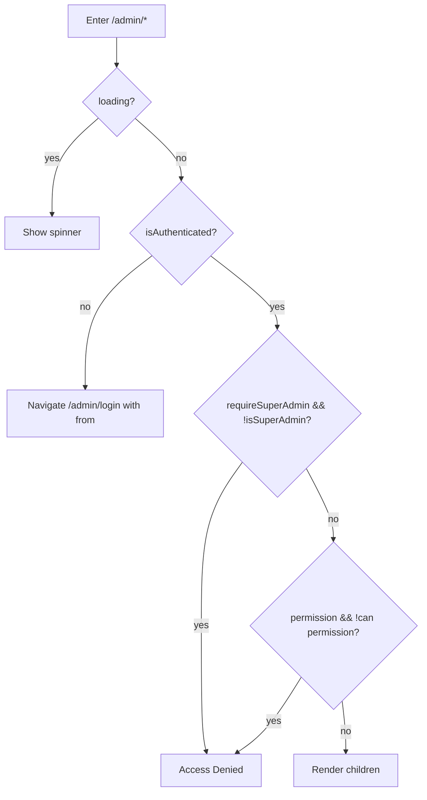

### 19.3 Club registration submit

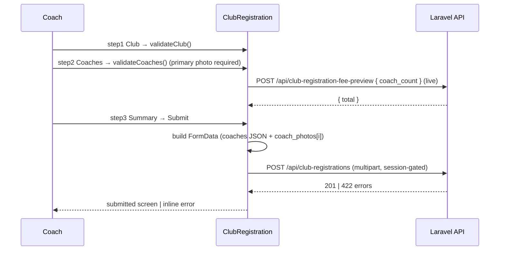

### 19.4 Member books a facility (view availability)

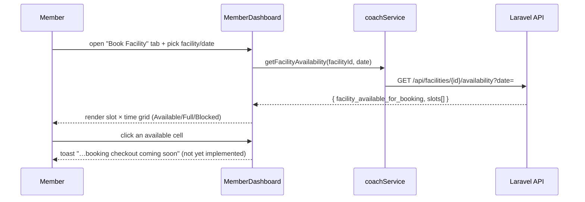

---

## 20. Possible Interview Questions

> 100+ questions with answers, grouped by theme. Answers reflect *this* codebase.

### A. Architecture & overview (1–12)

1. **What is SFMIS and what's the frontend's role?** A React SPA client for a university sports-facility management system; it's the UI half of a separate Laravel API backend (system of record).
2. **Why are there two separate auth systems?** Members are the public (passwordless OTP/session) while operators need credentialed, role-based access (password + bearer token). Different trust models → different mechanisms.
3. **How do the two realms coexist in one axios instance?** The instance sends both the cookie (`withCredentials`) and a bearer header; session routes ignore the header and `/api/system/*` ignore the cookie (`api.js:18-23`).
4. **Where is routing defined?** Inline in `App.js` (`BrowserRouter`+`Routes`); `routes/AppRouter.jsx` is an empty placeholder.
5. **What state-management library is used?** None — local `useState`, one React Context (back-office), router state + `sessionStorage`. No Redux/Zustand/React Query.
6. **Why no Redux?** Domain data is screen-scoped; the only app-wide state (admin identity) fits one Context. Adding Redux would be over-engineering for this scope.
7. **How is the service layer structured?** One module per domain (`auth/member/coach/systemAuth/systemUser/systemRole`), each function = one endpoint; `api.js` is the single transport.
8. **What does `api.js` do beyond creating axios?** Token storage helpers, request interceptor (attach bearer), response interceptor (admin 401 → logout+redirect), and `storageUrl()`.
9. **How does data flow from click to UI?** Handler → validate → service → axios → API → unwrap → setState → re-render + toast (+ optional navigate).
10. **Why is there a "shared dashboard" component?** `MemberDashboard` serves both club-student and independent roles via a `variant` prop — composition to avoid duplication.
11. **What's the rendering model?** Function components + hooks; `React.StrictMode` in dev.
12. **How are images handled?** Bundled local assets (imported) for branding; backend-served uploads are rewritten to `API_BASE` via `storageUrl()`.

### B. Authentication & authorization (13–30)

13. **Walk me through member login.** Email → check registered → send OTP → verify → branch on `account_exists`, `payment_status`, role → navigate.
14. **What credential authenticates a member action?** The Laravel session cookie set after OTP verification (carried by `withCredentials`).
15. **Is there a password for members?** No — passwordless OTP only.
16. **How is the admin token stored and why sessionStorage?** `sessionStorage["sfmis_admin_token"]`; survives refresh but not a new browser session, preventing silent re-auth past the login page.
17. **How is the admin token attached to requests?** A request interceptor adds `Authorization: Bearer <token>` to every request (`api.js:60-67`).
18. **How does the app survive a refresh in the admin area?** `AuthProvider` re-hydrates via `GET /api/system/me` if a token exists.
19. **What happens on an admin 401?** Response interceptor clears the token and redirects to `/admin/login` (except during login, which shows an inline error).
20. **How are protected routes implemented?** `ProtectedRoute` checks `loading` → spinner, `isAuthenticated` → redirect, then `permission`/`requireSuperAdmin` → Access Denied or render.
21. **What does `can(permission)` do?** Returns true for Super Admin always, else `permissions.includes(permission)`; false if no user.
22. **Is frontend authorization a security boundary?** No — it's UX. The backend re-checks every permission (stated in code comments).
23. **How is re-registration prevented?** Pre-OTP `isEmailRegistered` + post-verify `account_exists`, both routing the user to login; backend uniqueness is the real guard.
24. **Why "fail-open" on the registration lookup?** If the lookup errors, the flow proceeds and lets the backend's constraint catch duplicates — avoids blocking legit users on a transient error.
25. **How does logout differ between realms?** Members clear `sessionStorage` + navigate; admins call `/api/system/logout` (revoke) then clear locally even if it fails.
26. **What's `redirect_to` in verify-otp used for?** A backend hint for dashboard routing (`coach_dashboard` etc.), combined with role keyword matching.
27. **How does the login page tolerate backend key variants?** `handleVerify` reads many possible keys (`role`/`member_type`/`user_type`…, `account_exists`/`registered`/`exists`…) defensively.
28. **What is the OTP timer for?** UX countdown (165 s) + resend; real expiry is server-side.
29. **Could a user open a dashboard URL directly?** Yes, but with no router state and no `sessionStorage`, they're redirected to `/login` — and the backend would reject unauthorized data anyway.
30. **What's the XSS risk of the token in sessionStorage?** Any injected script could read it; mitigated by React's escaping and no `dangerouslySetInnerHTML`, but an `HttpOnly` cookie would be safer.

### C. Routing (31–38)

31. **Public vs private routes?** Public: home/login/registration/admin-login. Private: `/admin/*` (ProtectedRoute). Member dashboards are "semi-private" (state-gated, UX only).
32. **How is the `/admin` layout route built?** `AdminLayout` renders sidebar/header + `<Outlet/>`; children render inside; each child can have its own guard.
33. **How are inaccessible nav items hidden?** `NAV.filter(item => item.superAdminOnly ? isSuperAdmin : can(item.permission))`.
34. **How is the current page title computed?** Longest matching path wins (sort by `to.length`).
35. **What are `/register` and `/clubregister`?** Legacy aliases kept for old links.
36. **How does post-login "return to intended page" work?** `ProtectedRoute` passes `state.from`; `AdminLogin` navigates to `from || "/admin"`.
37. **Why does AdminLogin redirect if already authed?** To skip the form for an authenticated operator (`useEffect` on `isAuthenticated`).
38. **How does navigation carry data between member pages?** `navigate(path, { state })` + `useLocation().state`.

### D. State & data fetching (39–52)

39. **How is loading state handled?** Per-screen `loading` boolean → spinner; set in `finally`.
40. **How is error state handled?** Inline messages + toasts; admin pages centralize `errMessage()`.
41. **Why `Promise.allSettled` on dashboards?** So one failed call doesn't blank the page; each result defaults safely.
42. **How are tabs loaded lazily?** Effects keyed on `active === "<tab>"` fetch only when that tab opens.
43. **How is search debounced?** 300 ms `setTimeout` in an effect keyed on the filters, cleared on change (`SystemUsers`).
44. **How do you prevent setState after unmount?** An `on`/`active` flag set false in the effect cleanup before applying results.
45. **Are in-flight requests cancelled?** No (no AbortController); stale results are ignored via the flag instead.
46. **Where is derived state computed?** `useMemo` (e.g., `clubAttendances`, `stats`, grouped permissions).
47. **How is the member object kept across refresh?** Mirrored into `sessionStorage` and re-read on mount.
48. **Why enrich the member with `getMember(id)`?** `verify-otp` omits photo/some fields; the full record fills the avatar and profile.
49. **Is there any caching of API responses?** No — revisits refetch; explicit Refresh buttons exist.
50. **How would you add caching?** Introduce React Query/SWR keyed by endpoint+params, replacing the manual `useEffect` fetches.
51. **What's the response-shape quirk and how is it handled?** Single records come wrapped as `[[ … ]]`/`[obj]`; services `unwrap()` them.
52. **How are dropdowns (genders/clubs) populated?** GET category endpoints on entering the details step; clubs filtered to Active.

### E. Forms & validation (53–66)

53. **How is form validation done?** Hand-rolled functions returning an error map keyed by field; no form library.
54. **How are errors displayed?** Red field outline (`fieldClass`) + inline message (`fieldError`) + a summary line.
55. **When do field errors clear?** As soon as the user edits that field.
56. **What's the initials validation rule?** `/^([A-Za-z]\.\s?)+$/` — letters each followed by a dot (e.g., `A.B.`).
57. **What's the phone rule?** `^0[1-9]\d{8}$` (Sri Lankan 10-digit).
58. **What are the photo size limits?** 2 MB (member), 1 MB (coach); only the primary coach photo is required.
59. **How is the multi-step form state modeled?** A `step`/`phase` string (or numeric `step`) state machine.
60. **How is the summary tab protected?** You can only reach it via a validated details step; submit re-validates as a final guard.
61. **How are multipart uploads sent correctly?** Build `FormData`, never set `Content-Type` manually (browser adds the boundary).
62. **How are multiple coaches submitted?** As a JSON string under `coaches`, photos keyed `coach_photos[i]` by index.
63. **Why method-spoof PUT for member update?** PHP doesn't populate multipart bodies on PUT, so POST + `_method=PUT`.
64. **How is server validation surfaced if the client misses something?** Extract the first `errors` entry → message → generic fallback.
65. **Why define `Field`/`Input` at module scope in ClubRegistration?** Inline definitions remount inputs each keystroke and lose focus.
66. **How is the club fee computed?** Base 5,000 (club+2 coaches) + 2,500/extra coach; prefer server preview, fall back to local.

### F. Components & reuse (67–76)

67. **What's in the shared design system?** `DashboardUI.jsx`: tokens, `Icon`, `Pill`, `Avatar`, `StatCard`, `EmptyState`, `Spinner`, button/input classes.
68. **What's the AuthShell?** A split-screen auth layout with a 5 s rotating hero carousel; reused by login/registration/admin-login.
69. **Why do dashboards redefine Icon/Pill/Avatar locally?** They predate the shared module — a known duplication to refactor.
70. **What are Button/Input/Logo in common/?** Empty placeholder files (unused).
71. **How do StudentDashboard/IndependentDashboard differ?** Only the `variant` prop passed to `MemberDashboard`.
72. **What does `variant` change in MemberDashboard?** Portal label, the "My Club" tab, club data loading, and some labels.
73. **How is the modal pattern implemented?** A `Modal` shell (click-away + close button) toggled by a `modal` state object `{type, …}`.
74. **How is the permission matrix organized?** ~70 permissions grouped by module (regex match), collapsible, with search + select-all + per-group toggles; selection is a `Set` of ids.
75. **How are toasts shown app-wide?** One `<Toaster/>` in `App.js`; `toast.*` anywhere.
76. **How are SVG icons rendered?** An `Icon` component splits a `"d1|d2"` path string into multiple `<path>`s.

### G. Backend contract & domain (77–88)

77. **What's the category-table backbone?** Backend models every status/type as a `category` row; the frontend just renders descriptions and submits ids/strings. **[Assumption per CLAUDE.md]**
78. **How are member statuses progressed?** Pending Club Verification → Pending Payment → Active, via approval + payment. **[Assumption]**
79. **What does approve/reject do server-side?** Approve links the student to the club; reject moves them to Independent.
80. **What does simulate-success do?** Marks the pending fee paid, completes the payment step, activates the member when all steps done.
81. **What's session-gating?** Registration POSTs require the OTP-verified session; missing → 403.
82. **Why must endpoints be CSRF-exempt?** Routes ride the `web` stack; the SPA sends no CSRF token, so writes must be excepted server-side. **[Assumption]**
83. **What's `redirect_to` vs role?** Both are used to choose the dashboard; role is matched by keyword as a fallback.
84. **What fields can a member edit post-registration?** Personal details only (title, names, gender, NIC, phones, DOB, address, photo) — not email/type/club.
85. **How is "exists" determined without an exists endpoint?** Reuse `/api/members?search=` and confirm an exact case-insensitive email match.
86. **What's the availability response shape?** `{ facility_available_for_booking, slots:[{slot_code, time_slots:[{available,is_full,is_blocked,fee,…}]}] }`.
87. **How are club coaches displayed on the status page?** Fetch club + club members, filter to coaches, render each with a "You" badge for the current coach.
88. **Where do facility/attendance/payment numbers come from?** `coachService`/`memberService` GETs; attendance is filtered client-side to club members (no server club filter).

### H. Errors, performance, security, testing (89–105)

89. **Is there retry/backoff?** No — manual Refresh/Resend only.
90. **How are partial dashboard failures handled?** `allSettled` + per-result defaults; non-critical fetches swallow errors.
91. **What perf optimizations exist?** Parallel loads, lazy tabs, debounced search, `useMemo`/`useCallback`, memoized blob URLs.
92. **What perf issues remain?** No code splitting, no caching, in-render `createObjectURL` leak in club summary, icon duplication.
93. **How would you code-split?** `React.lazy` + `Suspense` per route in `App.js`, especially separating marketing from dashboards/admin.
94. **What XSS protections exist?** React escaping; no `dangerouslySetInnerHTML`; hardcoded SVG paths.
95. **Biggest security caveat to state explicitly?** Frontend auth/authorization is UX; backend is the authority.
96. **What env vars matter?** `REACT_APP_API_URL` (CRA exposes only `REACT_APP_`-prefixed; restart dev server after changes).
97. **What tests exist?** Only the default CRA `App.test.js`; Testing Library + jest-dom are set up.
98. **How would you test the OTP flow?** Mock `authService`, render `LoginPage`, simulate email→send→verify, assert navigation/branching.
99. **How would you test ProtectedRoute?** Render with a mocked `useAuth` for each case (loading/unauth/missing-permission/ok) and assert output.
100. **How is accessibility handled?** `aria-modal`/`role="dialog"`, `aria-label`s on icon buttons, labels tied to inputs — partial but present.
101. **How does the OTP input UX work?** 6 boxes, auto-advance on input, backspace-to-previous, paste fills all, numeric-only.
102. **How is the "no state → redirect" guard done?** `useEffect(() => { if (!member) navigate("/login",{replace:true}) })`.
103. **What happens when a coach has no club?** Empty states across tabs; requests/members/payments fetches are skipped.
104. **How would you add real booking checkout?** Wire the slot-cell click (currently a toast) to a booking endpoint + payment, then refresh availability.
105. **How is currency formatted?** `Number(v).toLocaleString("en-LK", { minimumFractionDigits: 2 })` via a `money()` helper.

### I. Scenario / design (106–112)

106. **Add a new admin-managed entity (e.g., Facilities CRUD).** Add a `facilityAdminService`, a `/admin/facilities` route guarded by a permission, a page reusing `DashboardUI` + the modal pattern, and a nav entry in `AdminLayout`.
107. **Migrate to React Query.** Replace manual `useEffect` fetches with `useQuery`/`useMutation` keyed by endpoint+params; remove `loading/error` booleans; add cache invalidation on mutations.
108. **Make member dashboards real-auth.** Add a member token or rely on the session cookie + a `/me` endpoint; re-validate identity on mount instead of trusting `sessionStorage`.
109. **Centralize the duplicated Icon/Pill/Avatar.** Import from `DashboardUI` everywhere; delete local copies.
110. **Handle token expiry gracefully app-wide.** Already partly done (401 interceptor); add proactive refresh or idle-timeout.
111. **Internationalize.** Extract strings, add a locale provider; currency already uses `en-LK`.
112. **Improve large-table performance.** Add pagination (server-side) or virtualization for members/payments/attendance.

---

## 21. Things Missing

### Missing validations / weak spots
- **Email validation is just `includes("@")`** in several places (`EmailStep`, `HomePage`, registration) — accepts `a@`. Use a stricter pattern.
- **NIC has no format validation** (any non-empty string passes).
- **No client validation of file *type*** beyond the `accept` attribute (size only).
- **Member dashboards trust `sessionStorage`/router state** for identity — no client re-verification of ownership.
- **No confirmation on destructive coach actions** (approve/reject fire immediately).

### Potential bugs
- **In-render `URL.createObjectURL`** in `ClubRegistration` summary/cards (`:808`, `:1002`) creates a new, unrevoked blob URL on every render → memory leak. (`StudentRegistration` does this correctly with `useMemo`+revoke.)
- **`StudentRegistration` "submitted" screen's "Proceed to Payment" is a stub** (`alert("Payment gateway — coming soon!")`, `:744`) while the real payment path exists via `RegistrationStatus`/`PaymentMethod` — inconsistent UX; a freshly-registered user can't reach the working payment flow without logging in.
- **`ClubRegistration` collects `sport`/`secondaryPhone` but the submit payload omits `sport`** (the field exists in `club` state and summary but isn't appended to FormData) — silently dropped. Confirm intended.
- **Booking is non-functional** — clicking a slot only toasts "coming soon" (`CoachDashboard.jsx:706`, `MemberDashboard.jsx:410`).
- **`getAttendances` has no server-side club filter**, so the coach view fetches all scans and filters client-side — a data-exposure/perf concern at scale.
- **`isEmailRegistered` fail-open** means a backend outage lets the UI proceed as if no account exists (acceptable by design, but worth noting).

### Bad practices / inconsistencies
- **Duplicated design primitives** (`Icon`/`Pill`/`Avatar`/`EmptyState`) in `HomePage`, `CoachDashboard`, `MemberDashboard` instead of importing `DashboardUI`.
- **Two registration pages re-implement the OTP gate** instead of reusing `EmailStep`/`OtpStep`.
- **Direct `axios`/`api` use inside components** (`StudentRegistration`, `ClubRegistration`) breaks the "all calls via services" rule.
- **Empty placeholder files** (`components/common/Button.jsx`, `Input.jsx`, `Logo.jsx`, `routes/AppRouter.jsx`, `context` historically) add noise.
- **Magic strings** for roles/statuses matched by `.includes("coach"/"club"/"paid")` — brittle if backend wording changes.
- **`web-vitals` measured but never reported anywhere.**

### Performance issues
- No code splitting / lazy routes; single large bundle.
- No request caching/dedup; repeated `getFacilities()` across screens.
- No table virtualization/pagination.

### Refactoring opportunities (prioritized)
1. **Adopt React Query** for all reads/mutations → removes \~all manual loading/error/`on`-flag boilerplate.
2. **Consolidate the design system** — import everything from `DashboardUI`; delete duplicates and empty placeholders.
3. **Reuse `EmailStep`/`OtpStep`** in both registration pages.
4. **Move the stray direct axios calls** into services (`clubService` for `/api/clubs`, `/api/member-genders`, fee preview, club registration).
5. **Extract identity** into a small member-side context (or proper auth) instead of `sessionStorage` juggling.
6. **Code-split routes** with `React.lazy`.
7. **Fix the blob-URL leak** in `ClubRegistration`.

---

## 22. Overall Summary

If you had to teach this project to another developer in five minutes:

> **SFMIS frontend is a React 19 SPA that talks to a Laravel API.** It has **two independent identity systems**: a **passwordless email-OTP/session-cookie** flow for members (students, independents, coaches) and a **password + Sanctum bearer-token + RBAC** console for back-office operators.
>
> **Routing** lives inline in `App.js`. Public/member routes are flat; the `/admin` subtree is a **nested protected route** guarded by `ProtectedRoute` + a single `AuthContext` (the app's only global state). Member screens carry identity via **router state + `sessionStorage`**, not a store.
>
> **All HTTP goes through `services/*.js` over one configured axios instance** (`api.js`) that sends the session cookie *and* a bearer token, normalizes the backend's nested-array responses, and globally handles admin 401s. There is **no Redux and no React Query** — data is fetched with `useEffect`+`useState`, loaded in parallel with `Promise.allSettled`, and refreshed manually.
>
> **The core domain flow is registration → approval → payment → activation:** a student registers (OTP-gated multipart form), a coach approves their club request, then the student logs in, lands on a **payment-pending status page**, and completes a **(simulated) payment** that activates the membership. Coaches and members then get **role-specific dashboards** (a shared `MemberDashboard` powers both member roles via a `variant` prop).
>
> **Styling** is Tailwind + a shared `DashboardUI` design system (with some legacy per-page duplication). **Validation** is hand-rolled per form with field-keyed error maps. The most important mental model to keep: **the frontend's auth and permission checks are UX conveniences — the Laravel backend is the real authority on identity, uniqueness, and access.**

**The map you should keep in your head:**

```
index.js → App.js (Router + Toaster + AuthProvider)
   ├── Public:  HomePage, LoginPage(EmailStep/OtpStep), Select/Student/ClubRegistration, RegistrationStatus, PaymentMethod
   ├── Member dashboards: CoachDashboard, MemberDashboard(club|independent)
   └── /admin (ProtectedRoute → AdminLayout/Outlet): AdminDashboard, SystemUsers, Roles
            ▲                         ▲
        useAuth/AuthContext      ProtectedRoute(permission|superAdmin)

services/*  ── api.js (axios: cookie + bearer, interceptors, storageUrl) ──▶ Laravel API
```
